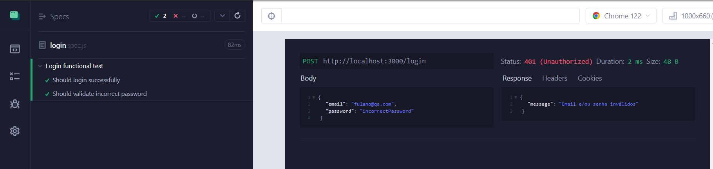
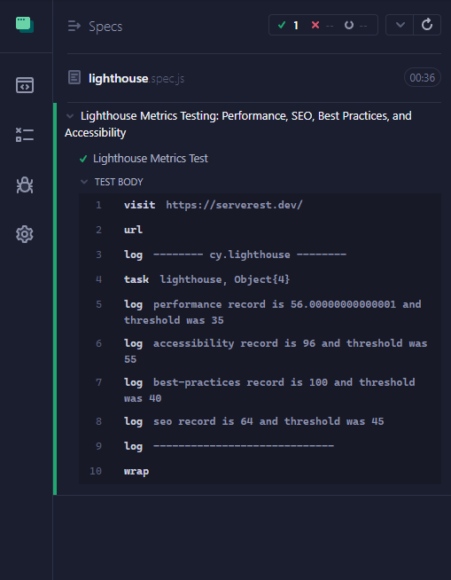

<h1 align="left"> Cypress-QA-API  </h1>

### Introduction

This is a software testing project focused on API testing using the ServeRest free REST API. ServeRest simulates an online store and is widely used for API testing studies and practices.

### Environment Setup

**Prerequisites:**

- <a href="https://docs.npmjs.com/cli/v6/commands/npm-install"> Node.JS </a>

### Installing Dependencies

Before running the tests, make sure you have the necessary dependencies installed. You can do this by running the following command:

```
npm install
```

### Starting ServeRest API

To start the ServeRest API locally, you can use the following command:

```
npx serverest@latest
```

### Running Cypress Tests:

- To run Cypress and start the framework, you can use the following command:

```
npx cypress open
```

- Alternatively, you can run Cypress without opening the Cypress UI:

```
npx cypress run
```

- To run a specific test, provide the path to the test file as an argument:

```
npm run cy:test "root/folder/file.spec.js"
```

### Tools and Resources Used

- **ServeRest**: [Free REST API](https://serverest.dev/) used to simulate an online store.
- **Cypress**: Front-end testing framework for web applications.

## Results

### Login API Test

The login API test is performed using the Cypress framework and the `cy.api()` method provided by the `cypress-plugin-api` plugin. Below is an example test scenario for viewing request information in the Cypress UI:



### Lighthouse Evaluation Test

In addition to API tests, the project also includes tests to evaluate Lighthouse metrics on a website. These tests are performed using the `@cypress-audit/lighthouse` plugin and evaluate Performance, SEO, Best Practices, and Accessibility metrics.

